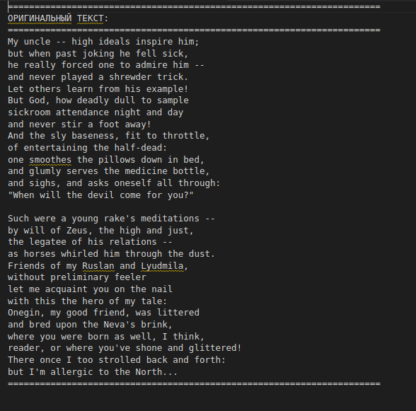
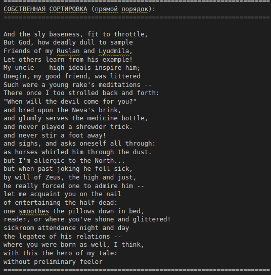
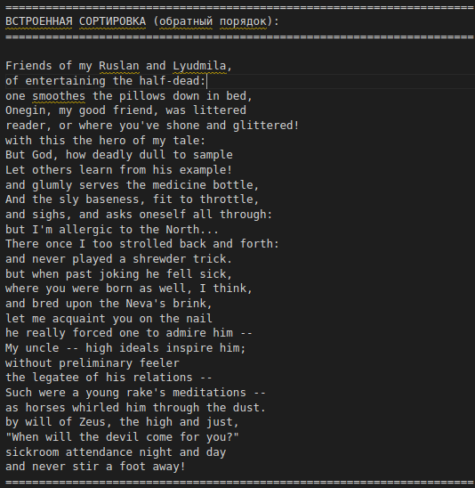

# OneginSort

 Program that sorts text lines in two orders.

## How to build project

 To compile the project run ``make`` in the root directory, it will create app file``./main``.

## Input

 In file ``./Texts/text_input.txt`` type text for sort.

## Output

 Run ``./main``, after it in file ``./Texts/text_output_sorted.txt`` you will see your text sorted in 2 orders: forward and backward.

## Example of work

 Basic example of sorting is work with text of A.S.Pushkin poem "Eugene Onegin". Initially, program goal was to process it.

 ``./Texts/text_input.txt``:

 

 ``./Texts/text_output_sorted.txt``:

 
 
